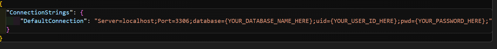
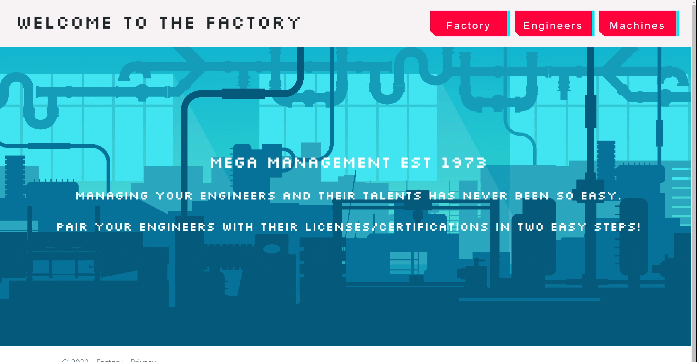

# _Many To Many Relationships_

#### By _**Sean Keane**_

#### Dr.Sillystringz's Factory - Epicodus Code Review 8/12/2022

## Technologies Used

* C#
* .NET 5.0
* ASP.NET Core MVC
* MySQL
* Entity Core Framework

## Description
_This is a project I created at Epicodus that allows Dr.SillyStringz's to input both engineers and machines into a database using MySQL.  The user is presented with a "Splash Page" and has the options of selecting Engineers or Machines. The user has the ability to assign machines to licensed engineers, utilizing a many to many relationship. Developing this application helped grow my understanding of C#, .NET, ASP.NET Core MVC, Databases, and Entity Core Framework._

## Setup/Installation Requirements

1) Clone this repository to your desktop.
2) Navigate to the now installed directory and open in your editor of choice.
3) Create your own database using the data from `sean_keane.sql`.  Import this data into your MySQL workbench.

4) Create a new file within the Factory directory.  Use the command `touch appsettings.json`
5) Please copy the text in the image below and enter your own entry points (Enter your database, userId, and password within appsettings.json).

6) Open the directory and `cd to Factory`.
7) To build the Factory enter: `dotnet build`.
8) To run the Factory enter: `dotnet run`.
9) Open your browser of choice and use the url: http://localhost:5000/

## For a visual representation of setup and a successfully built application, please consult the attached Gifs.

## Project can be found at:
https://github.com/CanadianRunner/SillystringzsFactory.Solution.git

## Known Bugs

* No known bugs.

## License

If you have any questions or concerns feel free to contact me at code@sean-keane.com\

Custom button CSS was created by Steven Lei https://getcssscan.com/css-buttons-examples 

*This is licensed under the MIT license*

Copyright (c) 8-12-2022 **_Sean Keane_**

